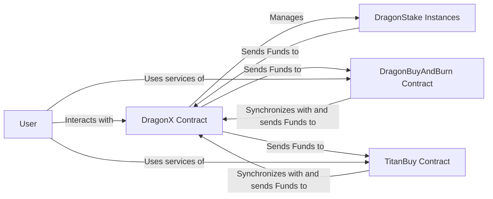

## System Architecture Overview

### DragonX Ecosystem
The DragonX ecosystem comprises interconnected contracts that enable various functionalities like token minting, staking, and token trading. The core contracts in this ecosystem are DragonX, DragonBuyAndBurn, and TitanBuy.

1. **DragonX Contract**
   - Primary contract managing the overall functionality of the ecosystem.
   - Manages instances of the DragonStake contract for staking purposes.
   - Provides user-accessible functions for various operations.
   - Interacts with DragonBuyAndBurn and TitanBuy contracts for token transactions.

2. **DragonBuyAndBurn Contract**
   - Handles the purchase and burning of tokens to manage liquidity and token value.
   - Offers external functions for users to interact with (e.g., buying and burning tokens).
   - Interacts directly with the DragonX contract for operational synchronization.

3. **TitanBuy Contract**
   - Facilitates the purchase of TitanX tokens.
   - Provides external functions for user interaction and transactional processes.
   - Interacts with the DragonX contract for operational consistency.

### Interactions
- Users interact with DragonX for staking and various token-related functionalities.
- DragonX, as the central contract, manages the staking process and token transactions with DragonBuyAndBurn and TitanBuy.
- DragonBuyAndBurn and TitanBuy offer dedicated functionalities for token management and interact with DragonX to complete these operations.

## Overview

